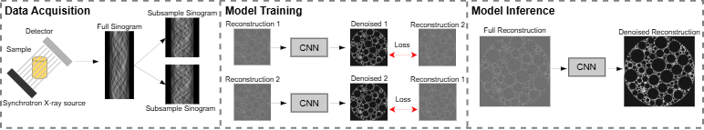

# 2.5D Noise2Inverse for Denoising CT Data

## Overview

This project provides an implementation of the Noise2Inverse (N2I)
framework for denoising CT data without requiring ground truth images.
It implements the 2.5D approach utilizing adjacent slices in the deep
learning model. A simple U-Net model with leaky ReLU and group norm is
used for denoising.



## Assumptions

-   All output (training results, inference results, trained models) are
    saved inside the reconstruction directory.

    -   User: John Smith
        -   Sample 1 Directory:
            -   Provided by the User:
                -   Full Reconstruction (Directory)
                -   Sub-Reconstruction 1 (Directory)
                -   Sub Reconstruction 2 (Directory)
            -   Provided by N2I:
                -   `config.yaml`
                -   TrainOutput (Directory)
                -   `denoised_slices/`
                -   `denoised_volume/`

-   Data for training/inference is already created.

    -   This project does not generate reconstructions.

-   Data is saved as `.tiff` files (`.tif` or `.tiff`).

-   Model type/size is consistent across datasets.

    -   U-Net without skip connections + leaky ReLU + group norm has
        proven robust.

-   Inference can run while training is still in progress.

## Features

-   Automatic batch size optimization for A100/V100 GPUs
    -   Accounts for image size, GPU memory, and model size to reduce
        OOM errors.
-   Support for 2.5D inference with PyTorch
-   Flexible plug-and-play workflow across different samples/users

## Installation

Create the conda environment:

``` bash
conda env create -f n2i_environment.yml
```

Dependencies include:

-   albumentations (data augmentation)
-   pytorch (2.4.0)
-   cuda (11.8)
-   tifffile
-   tqdm
-   matplotlib
-   skimage

## Project Structure

    N2I/
    ├── data.py
    ├── data_util.py
    ├── denoise_slice.py
    ├── denoise_volume.py
    ├── eval.py
    ├── loss.py
    ├── main.py
    ├── model.py
    ├── tiffs.py
    ├── utils.py
    ├── train.sh
    ├── denoise_slice.sh
    ├── denoise_volume.sh
    ├── environment.yaml
    └── baseline_config.yaml

## Getting Started

### Bash Scripts

Add the path to the virtual environment inside each `.sh` script.

### Config File

Copy `baseline_config.yaml` into your reconstruction directory and
modify:

-   Path to directory
-   Names of full reconstruction and sub-recon directories

### Training

``` bash
bash train.sh /path/to/config.yaml
```

Training workflow:

1.  Load parameters from config file
2.  Setup DDP (2 GPUs)
3.  Create training output directory
4.  Load dataset
5.  Initialize model/optimizer
6.  Randomly select patch size
7.  Warmup with L1Loss before enabling LCL loss
8.  Save best models based on validation + edge metrics
9.  Save predicted images every 5 epochs

### Denoise Slice

``` bash
bash denoise_slice.sh /path/to/config.yaml 500
```

-   Loads pretrained model
-   Fetches slice ± neighboring slices (2.5D)
-   Applies sliding window patching
-   Normalizes using training statistics
-   Saves `.tiff` to `denoised_slices/`

### Denoise Volume

``` bash
bash denoise_volume.sh /path/to/config.yaml 500 600
```

-   Optionally denoise slice subset
-   Directory `denoised_volume/` is recreated each run
-   Automatic batch size calculation
-   Sliding window patching
-   Mini-batch inference
-   Saves output `.tiffs`

### Denoise Example 


## Contributing

Areas for improvement:

-   Fine-tuning from previous models (reduces training time from 8--12
    hrs to \~30--60 min)
-   Exploring alternative architectures beyond U-Net
